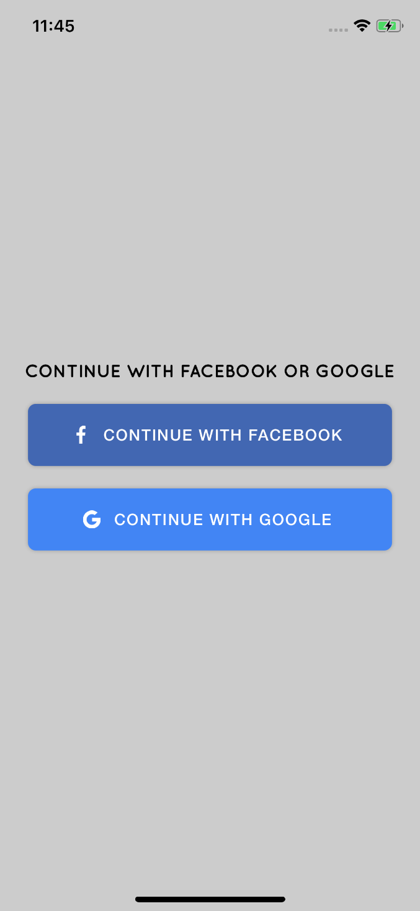
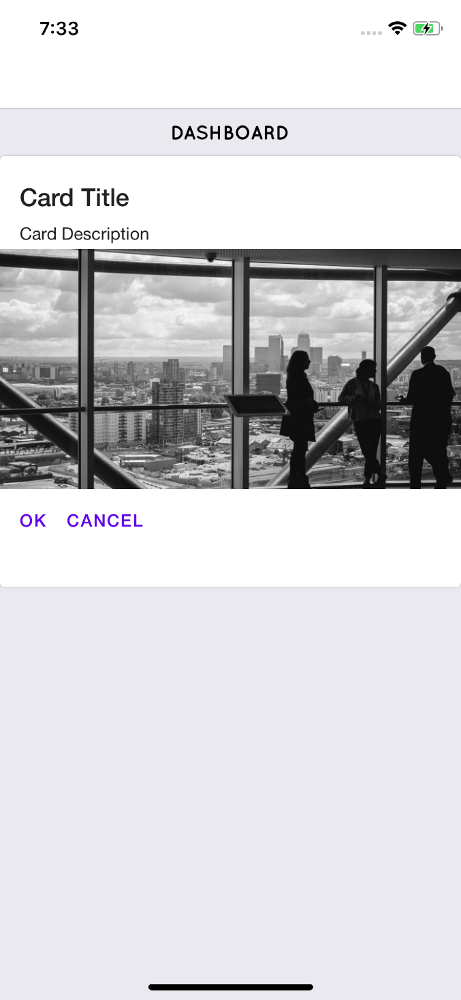
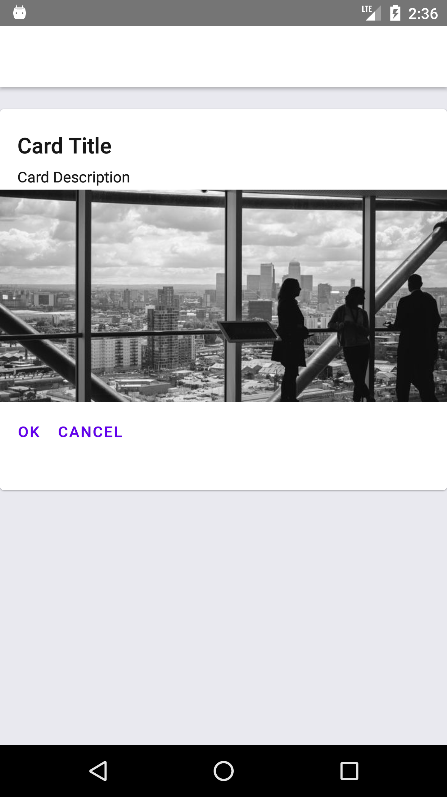

# react-native-boilerplate
A collection of curated and well maintained React Native boilerplates with various possiblities and combinations.

## List of React Native boilerplates
* [RN-01 RN-REDUX-REACTNAVIGATION](https://github.com/Taimoormk/react-native-boilerplate/tree/RN01)
* [RN-02 RN-REDUX-THUNK-REACTNAVIGATION](https://github.com/Taimoormk/react-native-boilerplate/tree/RN02)
* [RN-03 RN-REDUX-SAGA-REACTNAVIGATION](https://github.com/Taimoormk/react-native-boilerplate/tree/RN03)
* [RN-04 RN-REDUX-THUNK-RESELECT-REACTNAVIGATION](https://github.com/Taimoormk/react-native-boilerplate/tree/RN04)
* [RN-05 RN-REDUX-SAGA-RESELECT-REACTNAVIGATION](https://github.com/Taimoormk/react-native-boilerplate/tree/RN05)

### Documentations for RN-06 RN-REDUX-REACTNAVIGATION-STYLEDCOMPONENTS

#### Technologies
* [React Native](https://facebook.github.io/react-native/)
* [Redux](https://redux.js.org/)
* [React Navigation](https://reactnavigation.org/)
* [Styled Components](https://www.styled-components.com/)
* [JSS (JavaScript Styling)](https://cssinjs.org/?v=v9.8.7)
* [React Native Paper UI](https://callstack.github.io/react-native-paper/)
* [React Native Vector Icons](https://oblador.github.io/react-native-vector-icons/)

#### Project Setup
* Note: Use ReactNativeDebugger app to properly debug the React/Redux parts of the application.
* For iOS build, run `yarn ios`.
* For Android build, run Android Emulator first, once it's fully loaded, run `yarn android`.
* This project uses ESLint to maintain code consistency.
* This project uses Prettier to automatically format the code on the pre-commit hook level,

#### Link Commands
* Link React Native Vector Icons `$ react-native link react-native-vector-icons`.
* Link Custom Fonts `$ react-native link`.

#### Screenshots

  
  

  
  

